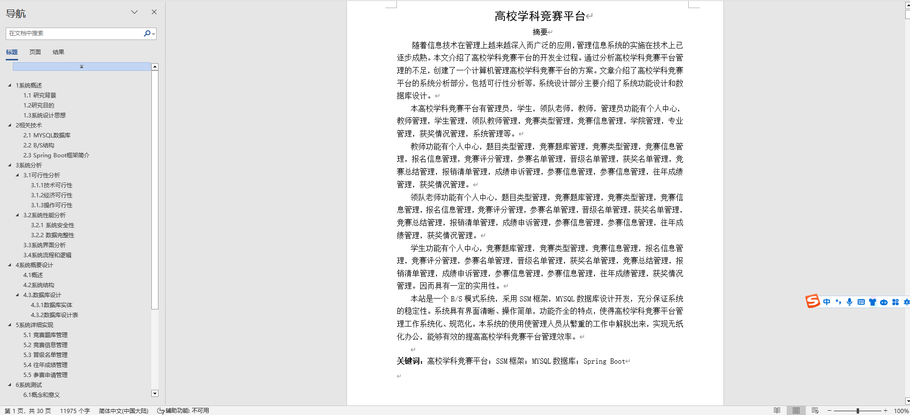
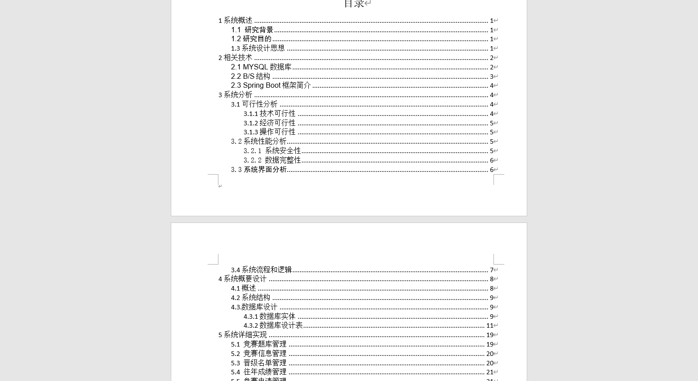
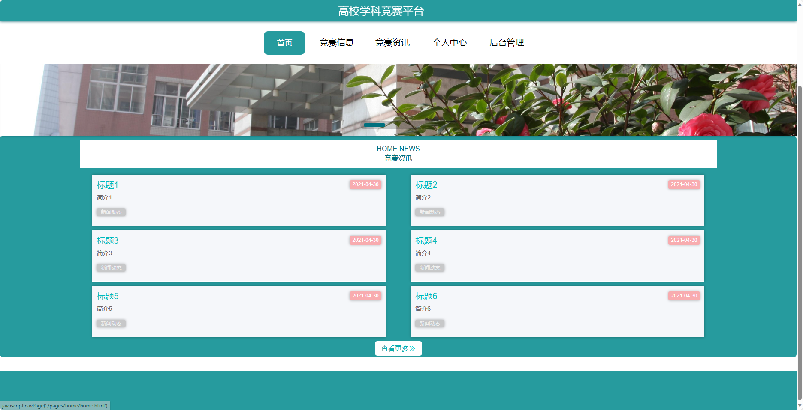
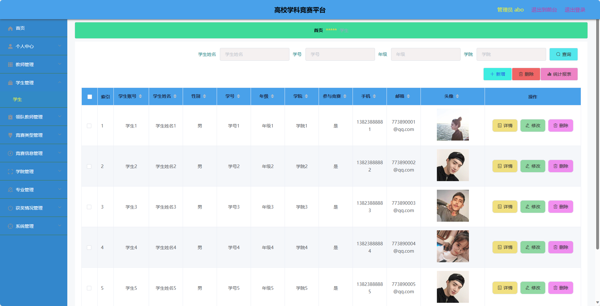
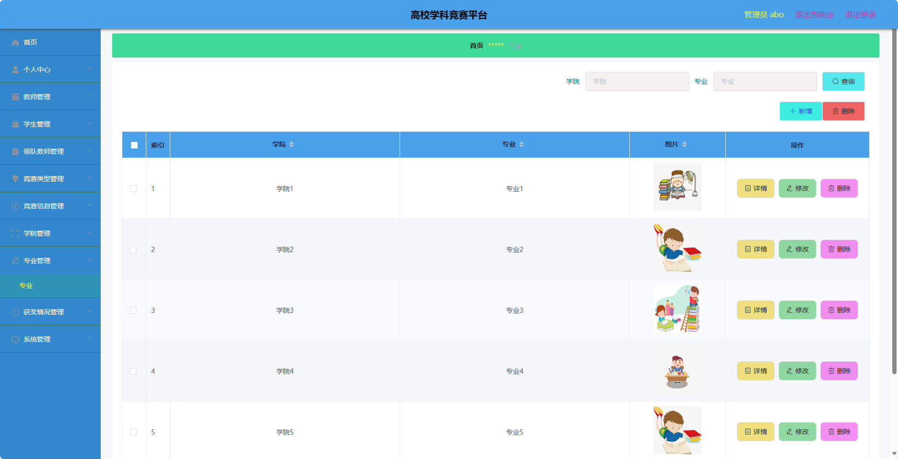

基于SpringBoot的高校学科竞赛平台（程序+论文）
=
- 完整代码获取地址：从戎源码网 ([https://armycodes.com/](https://armycodes.com/))
- 作者微信：19941326836  QQ：952045282 
- 承接计算机毕业设计、Java毕业设计、Python毕业设计、深度学习、机器学习
- 选题+开题报告+任务书+程序定制+安装调试+论文+答辩ppt 一条龙服务

一、项目介绍
---
基于Spring Boot框架实现的高校学科竞赛平台，系统包含两种角色：管理员、用户,系统分为前台和后台两大模块，主要功能如下。
### 前台：
1. 首页：展示竞赛平台的基本信息和推荐竞赛活动。
2. 竞赛信息：提供竞赛的详细信息。
3. 竞赛资讯：发布最新的竞赛相关资讯和通知。
4. 个人中心：用户可以查看和编辑个人信息，包括个人资料、报名记录等。

### 后台：
### 管理员：
1. 个人中心：管理员可以管理自己的个人信息和权限。
2. 教师管理：对教师信息进行管理，包括添加、修改和删除教师信息。
3. 学生管理：对学生信息进行管理，包括添加、修改和删除学生信息。
4. 领队教师管理：管理领队教师的信息，包括添加、修改和删除领队教师信息。
5. 竞赛类型管理：管理竞赛的类型，包括添加、修改和删除竞赛类型。
6. 竞赛信息管理：管理竞赛的详细信息，包括添加、修改和删除竞赛信息。
7. 学院管理：管理学院的信息，包括添加、修改和删除学院信息。
8. 专业管理：管理专业的信息，包括添加、修改和删除专业信息。
9. 获奖情况管理：管理竞赛的获奖情况，包括添加、修改和删除获奖情况信息。
10. 系统管理：管理系统的参数设置和日志记录。

教师：
1. 个人中心：教师可以查看和编辑个人信息。
2. 题目类型管理：管理竞赛题目的类型，包括添加、修改和删除题目类型。
3. 竞赛题库管理：管理竞赛题目的库，包括添加、修改和删除竞赛题目。
4. 竞赛类型管理：管理竞赛的类型，包括添加、修改和删除竞赛类型。
5. 竞赛信息管理：管理竞赛的详细信息，包括添加、修改和删除竞赛信息。
6. 参赛申请管理：管理学生的参赛申请，包括审核和处理申请。
7. 竞赛评分管理：对参赛作品进行评分。
8. 参赛名单管理：管理参赛学生的名单，包括添加、修改和删除名单。
9. 晋级名单管理：管理晋级学生的名单，包括添加、修改和删除名单。
10. 获奖名单管理：管理获奖学生的名单，包括添加、修改和删除名单。
11. 竞赛总结管理：学科竞赛活动总结的管理，包括撰写和发布总结。
12. 报销清单管理：管理学生的报销清单，包括审核和处理报销。
13. 成绩申诉管理：处理学生对成绩的申诉。
14. 参赛信息管理：管理学生的参赛信息，包括添加、修改和删除参赛信息。
15. 往年成绩管理：管理往年竞赛的成绩，包括添加、修改和删除成绩信息。
16. 获奖情况管理：管理竞赛的获奖情况，包括添加、修改和删除获奖情况信息。

二、项目技术
---
- 编程语言：Java
- 数据库：MySQL
- 项目管理工具：Maven
- 前端技术：VUE、HTML、Jquery、Bootstrap
- 后端技术：Spring、SpringMVC、MyBatis

三、运行环境
---
- 操作系统：Windows、macOS都可以
- JDK版本：JDK1.8以上都可以
- 开发工具：IDEA、Ecplise、Myecplise都可以
- 数据库: MySQL5.7以上都可以
- Tomcat：任意版本都可以
- Maven：任意版本都可以

四、运行截图
---
### 论文截图：

### 程序截图：

